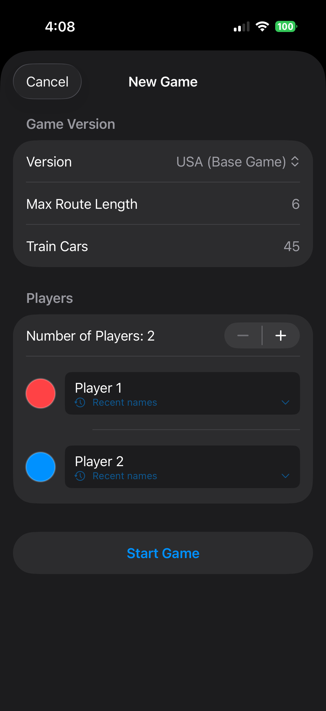
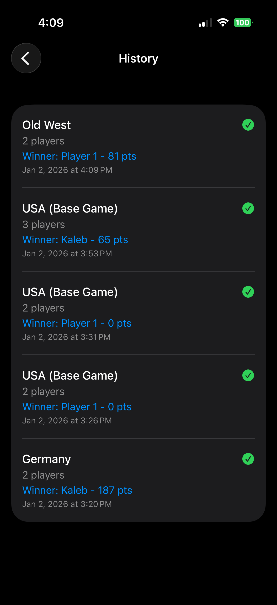

# TrainTally 🚂

A mobile score-tracking app for Ticket to Ride board games with cloud-synced leaderboards and family group support.


## Screenshots
<p align="center">
  
  
  
  
  
</p>


## Project Status

| Component | Status |
|-----------|--------|
| iOS App - Core Scoring | ✅ Complete |
| iOS App - Game History | ✅ Complete |
| iOS App - Multi-version Support | ✅ Complete |
| Local Persistence (SwiftData) | ✅ Complete |
| AWS Backend (Cognito, Lambda, DynamoDB) | 🚧 Planned |
| Cloud Leaderboards | 🚧 Planned |
| Family Groups | 🚧 Planned |
| Camera Auto-Scoring | 🔮 Future |

## Features

### Implemented ✅
- **Multi-version scoring** — Supports USA Base Game, Germany, Old West with version-specific rules
- **Dynamic UI** — Route buttons, bonuses, and features adapt based on selected game version
- **Train car tracking** — Visual progress bar with over-limit warnings
- **Destination tickets** — Add completed (+points) or failed (-points) tickets
- **Meeple scoring** — Germany expansion passenger scoring with majority bonuses
- **Game history** — Persistent local storage of all completed games
- **Player name memory** — Remembers frequently used player names

### Planned 🚧
- AWS Cognito authentication (optional, for cloud features)
- DynamoDB-backed leaderboards
- Private family/friend groups with invite codes
- Global leaderboards with moderation
- Cross-device sync

## Tech Stack

### iOS App
| Technology | Purpose |
|------------|---------|
| Swift 5.9 | Primary language |
| SwiftUI | Declarative UI framework |
| SwiftData | Local persistence |
| MVVM | Architecture pattern |

### Backend (Planned)
| Technology | Purpose |
|------------|---------|
| AWS Cognito | User authentication |
| AWS Lambda | Serverless functions (Python) |
| AWS API Gateway | REST API |
| AWS DynamoDB | NoSQL database |
| AWS SAM | Infrastructure as Code |

## Repository Structure

```
TrainTally/
├── ios/                    # iOS app (Swift/SwiftUI)
│   └── TrainTally/
│       ├── App/            # App entry point
│       ├── Models/         # Data models (Player, GameSession, etc.)
│       ├── Views/          # SwiftUI views
│       ├── ViewModels/     # View models (planned)
│       ├── Services/       # Business logic services
│       └── Config/         # Game version JSON
├── backend/                # AWS Lambda functions (planned)
│   ├── functions/          # Individual Lambda handlers
│   └── shared/             # Shared utilities
├── config/                 # Shared configuration
│   └── game-versions.json  # Game rules definition
├── infrastructure/         # AWS SAM/CloudFormation (planned)
└── docs/                   # Documentation and images
```

## Supported Game Versions

Game-specific rules are defined in `config/game-versions.json`, making it easy to add new versions without code changes.

| Version | Route Lengths | Special Features |
|---------|---------------|------------------|
| USA (Base Game) | 1-6 | Longest Route bonus |
| Germany | 1-7 | Meeples, Globetrotter bonus |
| Old West | 1-7 | 40 train cars, 6 players |

### Adding New Versions

To add a new game version, add an entry to `config/game-versions.json`:

```json
{
    "id": "version_id",
    "displayName": "Display Name",
    "minPlayers": 2,
    "maxPlayers": 5,
    "trainCarsPerPlayer": 45,
    "stationsPerPlayer": null,
    "playerColors": ["colors_available"],
    "routeScoring": [
    {"length": 1, "points": 1},
    {"length": 2, "points": 2},
    {"length": 3, "points": 4},
    {"length": 4, "points": 7},
    {"length": 5, "points": 10},
    {"length": 6, "points": 15}
    ],
    "features": {
    "hasStations": false,
    "hasMeeples": false,
    "hasFerries": false,
    "hasShips": false
    },
    "bonuses": [
    {
        "id": "bonus_id",
        "displayName": "bonus_display_name",
        "points": 10,
        "description": "description of the bonus",
        "isExclusive": true,
        "isPerItem": false,
        "maxCount": null
    },
    ],
    "meepleConfig": null
}
```

## Getting Started

### Prerequisites
- macOS with Xcode 15+
- iOS 26.2+ simulator or device

### Running the iOS App

1. Clone the repository:
   ```bash
   git clone https://github.com/kalebhings/TrainTally.git
   cd TrainTally
   ```

2. Open the Xcode project:
   ```bash
   open ios/TrainTally.xcodeproj
   ```

3. Select a simulator (iPhone 17 Pro recommended) and press `Cmd + R` to build and run.

### Backend Setup (Coming Soon)

Backend infrastructure will use AWS SAM for deployment. Instructions will be added once implemented.

## Architecture

### iOS App Architecture

```
┌─────────────────────────────────────────────────────────┐
│                      SwiftUI Views                       │
│  ContentView → GameSetupView → ScoringView → Summary    │
├─────────────────────────────────────────────────────────┤
│                    ViewModels (MVVM)                     │
│         Manages state and business logic                 │
├─────────────────────────────────────────────────────────┤
│                      Models                              │
│  GameSession (SwiftData) | Player | GameVersion         │
├─────────────────────────────────────────────────────────┤
│                     Services                             │
│  GameConfigLoader | PlayerNameManager | (AWS Service)   │
├─────────────────────────────────────────────────────────┤
│                    Data Layer                            │
│         SwiftData (Local) | AWS (Cloud - planned)       │
└─────────────────────────────────────────────────────────┘
```

### Planned Cloud Architecture

```
┌──────────────┐     ┌──────────────┐     ┌──────────────┐
│   iOS App    │────▶│ API Gateway  │────▶│   Lambda     │
└──────────────┘     └──────────────┘     └──────────────┘
       │                                         │
       │              ┌──────────────┐           │
       └─────────────▶│   Cognito    │           │
                      └──────────────┘           │
                                                 ▼
                                          ┌──────────────┐
                                          │  DynamoDB    │
                                          └──────────────┘
```

## Scoring Logic

### Route Points
Points are awarded based on route length as defined in each game version's configuration.

### Destination Tickets
- Completed tickets: Add face value to score
- Failed tickets: Subtract face value from score

### Bonuses
- **Longest Route** (10 pts) — Awarded to player with longest continuous path
- **Globetrotter** (15 pts, Germany) — Most completed destination tickets

### Meeple Scoring (Germany)
- 1st place in a passenger color: 20 points
- 2nd place in a passenger color: 10 points

## Roadmap

- [x] Core scoring calculator
- [x] Multiple game version support
- [x] Local game history
- [x] Player name persistence
- [ ] AWS backend infrastructure
- [ ] User authentication (optional)
- [ ] Cloud leaderboards
- [ ] Family group sharing
- [ ] iPad layout optimization
- [ ] Android port (Kotlin)
- [ ] Camera-based auto-scoring

## Contributing

This is a portfolio project, but suggestions and feedback are welcome! Feel free to:
- Open issues for bugs or feature ideas
- Submit PRs for game version configs
- Suggest UI/UX improvements

## License

This project is licensed under the MIT License - see the [LICENSE](LICENSE) file for details.

---

**Note:** This app is a scoring utility and is not affiliated with Days of Wonder or the Ticket to Ride trademark.
